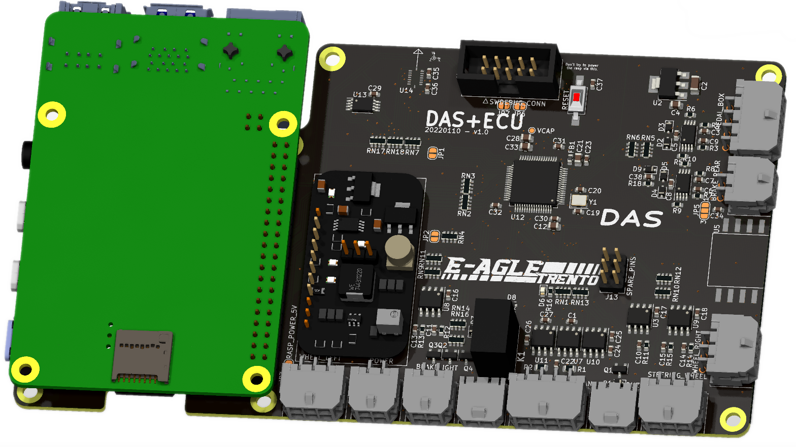

# ECU - hardware

ECU hardware design of the E-Agle Trento Racing Team car which run on Fenice.

## Contributors

- Filippo Volpe

## Documentation

Documentation can be found under [`./docs/DAS_ECU.md`](./docs/DAS_ECU.md)

