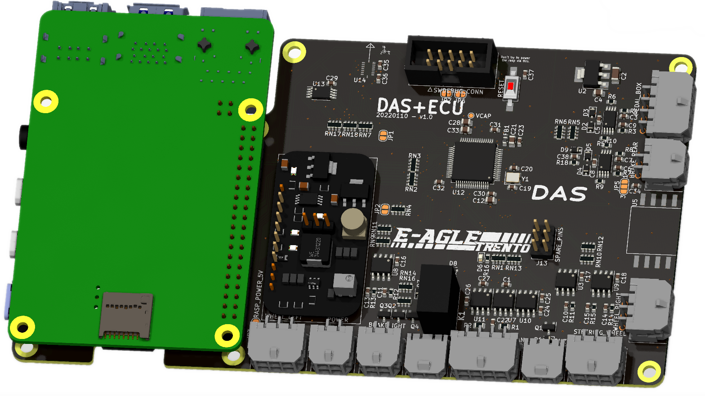
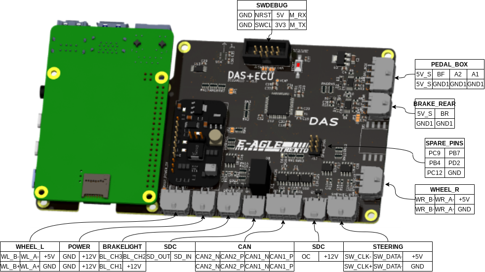
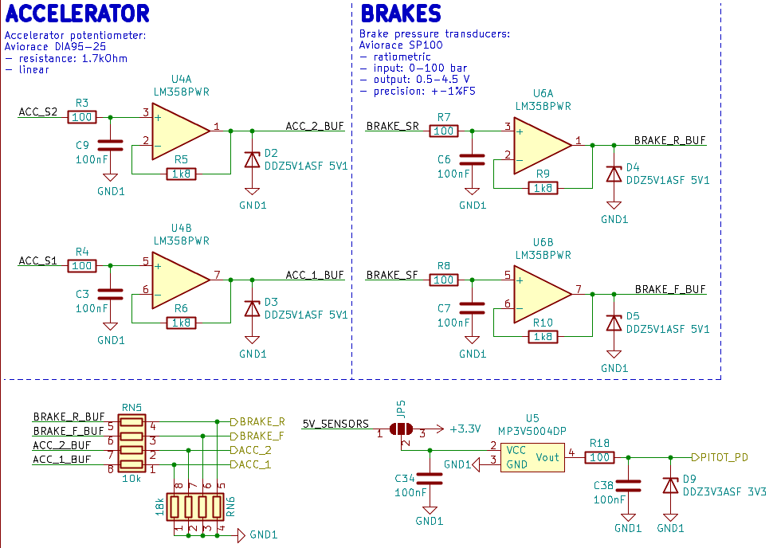
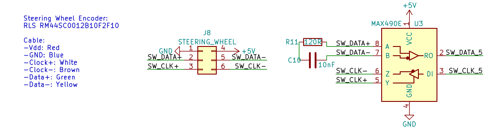
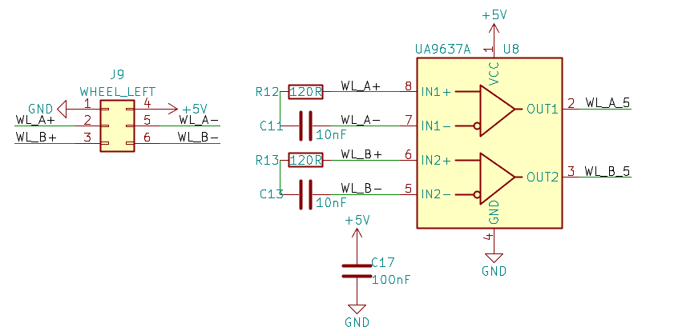
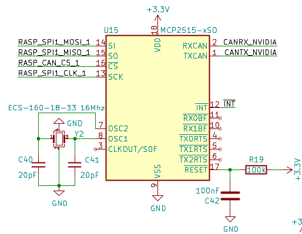
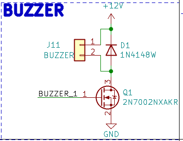

# ECU hardware

The ECU is the main brain of the vehicle and have to perform the following tasks:

- Host the vehicle state machine
- Gather all the sensor informations around the car
- Compute the actuations on the motors and possible future expansions

To do so the workload is split onto two processors:

- MCU
	- manages the vehicle fsm
	- connected to the 2 can buses present in the car
	- reads the two APPSs
	- reads the brake pressure sensors
	- actuates the brakelight
	- sensors pausabilities
	- shutdown connection
	- actuates the buzzer sound
	- steering position
	- wheel encoders
	- IMU
	- relays necessary sensor informations to the SBC
	- performs the final checks before sending actuations
- SBC
	- performs the heavier calculations for the actuations, motors and servos
	- connected to the primary can bus to be able to bypass the MCU

## Connectors

Below the quick reference of all connectors signals.

The SBC connector pinout here follows the raspberry GPIO40 numbers so it has to be seen from the bottom of the ECU board with PIN1 the lower left in the picture above.

Comments:
- 3V3 is present on the pin only with the corresponding jumper closed, usually it is not
- 5V is present on the pin only with the corresponding jumper closed, usually it is closed
- SPI1 connects the SBC to the CAN module
- SPI connects the SBC to the MCU, the SBC is the master due to Raspberry limitations
- UART signals as outputted from the SBC

| | | | |
| ---: | :---: | :---: | :--- |
|  1 | 3V3* | 5V** |  2 |
|  3 | NC |   5V** |  4 |
|  5 | NC |   GND  |  6 |
|  7 | NC |   RASP_TX |  8 |
|  9 | NC |   RASP_RX | 10 |
| 11 | RASP_RTS |   NC | 12 |
| 13 | NC |   GND  | 14 |
| 15 | NC |   NC | 16 |
| 17 | NC |   NC | 18 |
| 19 | RASP_SPI_MOSI |   GND  | 20 |
| 21 | RASP_SPI_MISO |   ~INT | 22 |
| 23 | RASP_SPI_CLK |   RASP_SPI_CS | 24 |
| 25 | GND |   RASP_CAN_CS | 26 |
| 27 | NC |   NC | 28 |
| 29 | CANRX_NVIDIA |   GND | 30 |
| 31 | CANTX_NVIDIA |   NC | 32 |
| 33 | NC |   GND | 34 |
| 35 | RASP_SPI1_MISO |   RASP_CTS | 36 |
| 37 | NC |   RASP_SPI1_MOSI | 38 |
| 39 | GND |   RASP_SPI1_CLK | 40 |

## Power

Power (nominal 12V) enters the board from the POWER connector and powers:

- DCDC module
- Analog section linear regulator
- Brakelight
- Buzzer
- SDC relay

The 5V output of the DCDC module powers:
- SBC
- Wheels encoders
- Steering encoder
- CAN transceiver outputs

The 5V output of the analog section's linear regulator powers only the analog sensors.

The 3V3 output of the DCDC module powers the rest.

## MCU configuration

The MCU STM32F446RET6 has the following solution found given the requirements:

- External crystal 16MHz
	- RCC HSE Crystal Resonator
- Debug interface
	- Serial wire
- Debugger UART communication
	- USART2
- General timing
	- TIM1, Clock Source is internal clock
- Wheels encoder mode timers, 32bit
	- TIM2,TIM5
- 2 CAN full featured busses
	- CAN1,CAN2
- SBC communication, UART with full hardware flow control
	- USART1
- SBC communication, SPI full duplex slave mode
	- SPI1, hardware NSS input
	- DMA to map the MCU RAM to the SPI master
- Steering position encoder
	- SPI3 receive only master
- EEPROM/SDCARD SPI
	- SPI2
- IMU:
	- SPI2
- 3 PWM channels for brakelight
	- TIM3, Clock Source is internal clock
- 4 ADC channels, 2 brakes and 2 accelerators
	- ADC1, 8kHz single channel sampling
- Pitot tube pressure reading
	- ADC1/2
- CRC module
- Buzzer PWM
	- PWM channel on TIM1

## IMU

> Not present at the time of writing.

The IMU used is the Bosch BMI088 accelerometer and gyroscope 6-axis unit.

Set the unused IMU pins as outputs to avoid leaving them floating.

### Interrupts

INT1 new accelerometer data is setted as output of the IMU.

INT3 new gyroscope data is setted as output of the IMU.

## Analog section

> See issue #1

The analog sensors have an indipendant linear supply to lower noise of the main switching DCDC.

The code reading the APPS must follow EV 2.3,.

As per T 11.8:
- the analog sensors are offsetted on the pedal
- the incoming signal difference is compared to detect implausability

The ACC_S1 is the higher signal, ACC_S2 is the lower signal.

A single pole low pass RC filter at a frequency of 16kHz is applied so that the signals can be sampled with low enough aliases up to 8kHz and further downsampled to the required frequency for the controls via digital filters after the ADC in the MCU.

The the 4 signals are lowered from 0V-5V to 0-3.3V with a transfer function of G=18/(10+18)~=0.6428

The supply of the differential pressure sensor can be selected with jumper JP5.

## Brakelight

The brakelight receives the 12V supply and 3 channels which are pulled low to turn on that channel, just like a common led light strip. In fact a 12V LED light strip can be attached to that connector and colors can be set by the ecu.

The 3 lines coming from the MCU can be used as follows, granted compliance with the rules:
- On CH[1,2,3] dutycycle equal and proportional to the brake pressure
- On CH1 blinking while regen (T*w < 0)

## MCU to Raspberry

The MCU is connected to a Raspberry GPIO40 interface of the SBC with:

- UART
  - bidirectional
  - hardware flow control
  - interrupts between the devices can be generated on the RTS CTS line if configured accordingly
- SPI
  - The SBC is the master of the bus
  - The MCU is read using DMA on the internal memory
  - a portion of the MCU RAM is memory mapped to the address space of the SBC

## Steering wheel encoder

The MAX490E transceiver has one channel balanced to unbalanced and one channel unbalanced to balanced and converts the single ended DATA and CLK signals from the MCU to the balanced equivalents.

The encoder on the wheel is then read by the MCU using the SPI master receive only mode with no chip select. The sensor sends 12 bits after 1 dummy bit. So 16bits can be read through and with bitwise magic the 12 needed bits are gathered. It's important to have the bit timings consistent, the encoder is not a simple shift register, an inconsistent bit timing could reset the encoder and throw off the communication.

The filtering is the line termination as recommended by the encoder datasheet.

## Wheel encoders

The UA9637A transceiver has two channels balanced to unbalanced and converts the balanced signals of the encoders to the unbalanced needed by the MCU.

The wheel encoders (Left and Rigth) are read using TIM2 and TIM5 respectively, which are 32bit, in 'encoder mode' and thus the code can just read and reset the internal counter which increments and decrements with the wheel movement.

The filtering is the line termination as recommended by the encoder datasheet.

## Raspberry GPIO

It has been designed for placing a normal Raspberry PI4 but due to GPIO cross compatibility other such SBC can be used such as Nvidia Nano.

> The SBC can be powered by the ECU 5V line if below 2.5A. A Raspberry is already on the limit. **When powering the SBC from outside open the power jumpers on the ECU.**

When using the Raspberry 4 SBC direct CAN access to the primary CAN can be added by populating the CAN ic in the image below as well as the corresponding CAN transceiver.

Instead some more capable SBCs (cough cough) such as the Nvidia nano already have the CAN module inside and directly outputs the CAN RXTX signals. In this case, if placed on pins 29 and 31 respectively only the transceiver is needed.

## Buzzer

The buzzer meant to be used is 12V, active. Meaning it contains its own oscillator thus the MCU signal should be just ON or OFF.

However the pin is connected to a timer channel so it could be PWMed when using a passive buzzer or a speaker but in this case other precautions should be taken, in particular the slow switching times, high PWM frequencies and low resistance speakers could fry the transistor.

> When using an active buzzer don't use PWM!